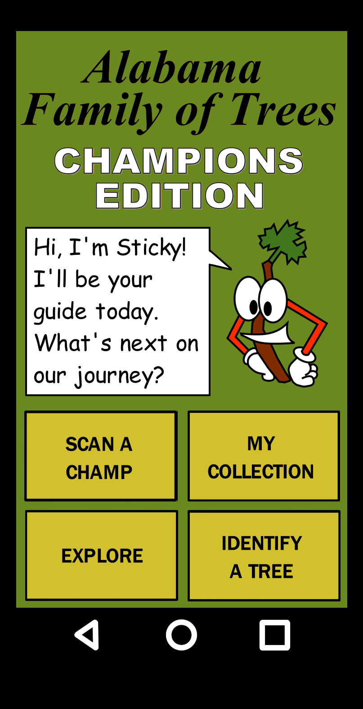

# AL Family of Trees: Champion's Edition

## Contributors

The project is built on the Meteor framework

### Getting Started

1. Clone this project and `cd` into the directory

2. If you haven't done so already,
[Install meteor](https://www.meteor.com/developers/install)

3. Run `meteor npm install --save @babel/runtime react react-dom`
**note: This step appears to be a bug. Shouldn't need to do this**

4. `run meteor`

You should see your app running on http://localhost:3000

### Documentation of Expected Functionality

* Rough wireframe layout of app operation: [WIP app wireframe](Screens.jpg)

* [Explanation](Genome_Compare.jpg) of graphics used to show genome comparisons between species

* [VA Tech - dichotomous key tree database online](http://dendro.cnre.vt.edu/dendrology/idit.htm)

* Color palette: [Spring Contrast](https://www.canva.com/colors/color-palettes/spring-contrast/)

* Source of key questions used for demo: University of Kentucky Department of Horticulture's [Dichotomous Keys for the Arboretum Walk](https://www.uky.edu/hort/sites/www.uky.edu.hort/files/pages-attachments/treekeys.pdf); additional info at [Kentucky Trees](https://www.uky.edu/hort/Kentucky-trees)
